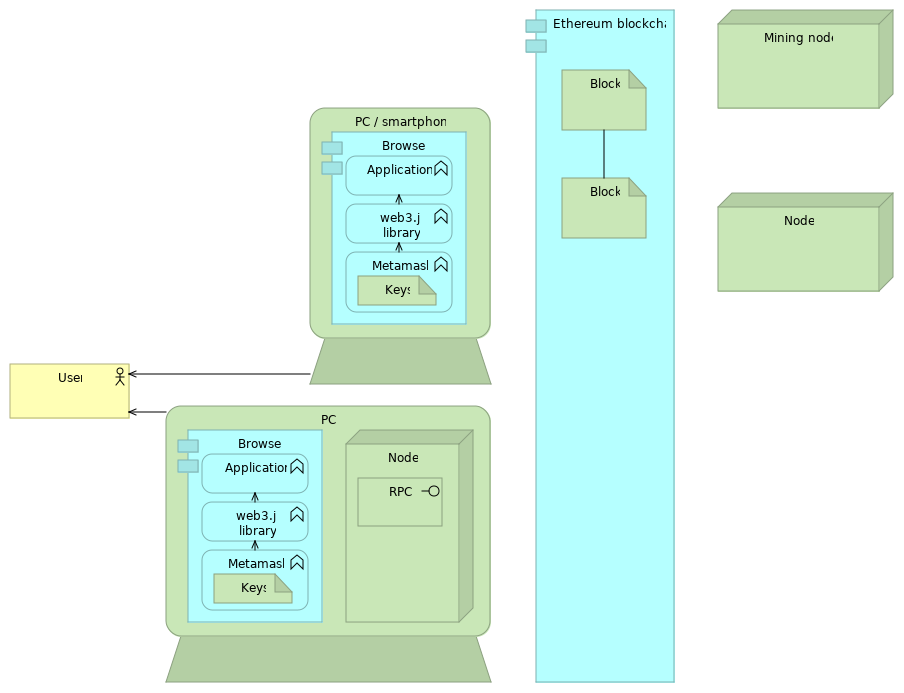

# ethereum
Examples related to ethereum

[Install Ethereum software](installation)
 
[Use Ethereum software](use)

| Ethereum Concepts | Instances                | More info (text) | More info (video) |   Install  |  Examples |
| --------------- |  ---------                  | ---------       | ---------          | ---------  |  -------- | 
| General info    |    |   [ethereum.org] [ethhub] [eth-intro] [eth-guide] [eth-fordevs] [basics] [ethdocs] [kauri]   |  [youtube-exp]
| Architecture    |                             |                   | [youtube-arch]
| Full node software | | [client-overview] [understand nodes]
| Development of ethereum itself | [eth-mag]
| Wallets
| Name services   | [ens] [enssimple]        | [ens-tutorial] | [youtube-ens]     | [ens-manager] 

[ethhub]:          https://docs.ethhub.io/
[ethereum.org]:    https://www.ethereum.org/
[eth-intro]:       https://medium.com/coinmonks/https-medium-com-ritesh-modi-solidity-chapter1-63dfaff08a11
[eth-guide]:       https://blockgeeks.com/guides/ethereum/
[eth-fordevs]:     https://blockgeeks.com/guides/?tagfilter=true&filter=Blockchain%20for%20Developers
[youtube-exp]:     https://www.youtube.com/results?search_query=ethereum+explained
[youtube-arch]:    https://www.youtube.com/results?search_query=ethereum+architecture
[basics]:          https://consensys.net/academy/blockchain-basics-book/
[ethdocs]:         http://www.ethdocs.org
[kauri]:           https://kauri.io

[Trinity/PyEVM]:   https://trinity-client.readthedocs.io
[client-overview]: http://www.ethdocs.org/en/latest/ethereum-clients
[Pantheon]:        https://pegasys.tech/solutions/
[understand nodes]: https://kauri.io/article/48d5098292fd4f11b251d1b1814f0bba/ethereum-101-part-2-understanding-nodes
[eth-mag]:         https://ethereum-magicians.org/
[ens]:             https://ens.domains/
[ens-tutorial]:    https://www.toptal.com/ethereum/ethereum-name-service-dapp-tutorial
[youtube-ens]:     https://www.youtube.com/results?search_query=ens+ethereum
[ens-manager]:     https://manager.ens.domains/
[enssimple]:       https://ethsimple.com/

| Ethereum Nodes  | Language |  Github | Documentation |
| --------------- |  --------| ------  | --------------|
| Geth	          | Go	     | 
| Parity	        | Rust	
| cpp-ethereum	  | C++	
| [Trinity/PyEVM] |	Python	
| EthereumJS      |	JavaScript	
| Ethereum(J)	    | Java
| Harmony         |	Java	
| Pantheon      	| Java	
| ruby-ethereum	  | Ruby	
| ethereumH	      | Haskell
| Quorum	        | Go 
| Exthereum	      | Elixir 	
| Aleth/eth       |
| Turbo Geth      |
| Nimbus          |
| Mana/Exthereum  |
| Mantis          |
| Nethereum       |

| Solidity                                  | Instances
| ---------------                           | -------- 
| Overview                                  | [solidity_indepth] [solidity_overview] [learn_solidity]
| Layout, comments, natspec                 | [tosh_layout] [natspec]
| General data types                        | [tosh_datatypes]
| Ether and Time Units                      | [tosh_ethertime]
| Control Structures                        | [tosh_control]
| Function Calls                            | [tosh_io] [tosh_functionret]
| Special Variables & functions             | [tosh_specials]
| Operators                                 | [tosh_operators]
[ Variables Scoping                         | [tosh_scoping]
| Arrays/Structs/Enums/Mapping              | [sol_mapping] [coursetro_map]
| Interfacing with other Contracts          | [tosh_import]
| Creating contracts                        | [sol_create] [tosh_createcon]
| Contract Inheritance (incl multiple)      | [tosh_inherit]
| Abstract Contracts                        | [tosh_abstract]
| Visibility Specifiers and Getters         | [sol_vis]
| Fallback Functions                        | [tosh_fallback]
| Function Modifiers                        | [tosh_modifiers]
| Events                                    | [tosh_events]
| Error handling                            | [sol_error] [tosh_except]

 

[solidity_indepth]:  https://solidity.readthedocs.io/en/develop/solidity-in-depth.html
[sol_vis]:           https://solidity.readthedocs.io/en/develop/contracts.html#visibility-and-getters
[sol_create]:        https://solidity.readthedocs.io/en/develop/contracts.html#creating-contracts
[sol_mapping]:       https://solidity.readthedocs.io/en/develop/types.html#mapping-types
[sol_error]:         https://solidity.readthedocs.io/en/develop/control-structures.html#error-handling-assert-require-revert-and-exceptions

[solidity_overview]: https://ethereumbuilders.gitbooks.io/guide/content/en/solidity_tutorials.html
[learn_solidity]:    https://www.bitdegree.org/learn/learn-solidity
[natspec]:           https://solidity.readthedocs.io/en/develop/natspec-format.html
[tosh_layout]:       https://www.toshblocks.com/solidity/layout-solidity-based-smart-contracts/
[tosh_datatypes]:    https://www.toshblocks.com/solidity/general-value-data-types-solidity/
[tosh_ethertime]:    https://www.toshblocks.com/solidity/ether-units-time-units-solidity-programming-language/
[tosh_specials]:     https://www.toshblocks.com/solidity/globally-available-variables-functions/
[tosh_operators]:    https://www.toshblocks.com/solidity/operators-arithmetic-logical-bitwise/
[tosh_control]:      https://www.toshblocks.com/solidity/control-structure-solidity-programming-language/
[tosh_scoping]:      https://www.toshblocks.com/solidity/scoping-declarations-variables-solidity/
[tosh_io]:           https://www.toshblocks.com/solidity/input-output-parameters-functions/
[tosh_functionret]:  https://www.toshblocks.com/solidity/function-calls-return-types-solidity/
[tosh_modifiers]:    https://www.toshblocks.com/solidity/function-modifiers-solidity-how-they-works/
[tosh_fallback]:     https://www.toshblocks.com/solidity/fallback-function-solidity/
[tosh_abstract]:     https://www.toshblocks.com/solidity/abstract-contracts-solidity/
[tosh_createcon]:    https://www.toshblocks.com/solidity/creating-contracts-via-new-operator/
[tosh_inherit]:      https://www.toshblocks.com/solidity/inheriting-smart-contracts/
[tosh_import]:       https://www.toshblocks.com/solidity/importing-compiling-smart-contracts/
[tosh_events]:       https://www.toshblocks.com/solidity/events-logging-solidity/
[tosh_except]:       https://www.toshblocks.com/solidity/exceptions-solidity/

[coursetro_map]:     https://coursetro.com/posts/code/102/Solidity-Mappings-&-Structs-Tutorial

| Development tools     | Instances                  |  More info (text) | More info (video) | Github   | Examples |
| ---------------       |  ---------                 | ------            | --------------    | ---------| ---------|
| General info          | [consensys-dev]            | [eth-devnews]
| Tools                 | [tool-list]
| Programming languages | [solidity-docs]
| Online edit&deploy    | [remix-eth] [play-eth]  | [remix-docu]            |
| Deploy               | [truffle]                  | [truffle-docu]          |                   | [truffle-github]
| Upgrade contracts     | [zeppelinos]               | [zep-docu] [sol5-zep]|  [youtube-zep] **[i1]** | [zep-github]  
| Blockchain access     | [infura] [blockcypher]  |                         |                  | [infura-github] [blc-github]  |  

[consensys-dev]:  https://ethereum.consensys.net/
[eth-devnews]:    https://weekinethereumnews.com/
[tool-list]:      https://github.com/ConsenSys/ethereum-developer-tools-list
[play-eth]:       https://play.ethereum.org/editor-solidity/
[remix-eth]:      https://remix.ethereum.org
[remix-docu]:     https://remix.readthedocs.io
[zeppelinos]:     https://zeppelinos.org/
[zep-github]:     https://github.com/zeppelinos
[zep-docu]:       https://blog.zeppelinos.org/
[truffle]:        https://truffleframework.com/
[truffle-github]: https://github.com/trufflesuite/truffle
[truffle-docu]:   https://truffleframework.com/docs
[solidity-docs]:  https://solidity.readthedocs.io
[infura]:         https://mainnet.infura.io/
[infura-github]:  https://github.com/INFURA
[blockcypher]:    https://www.blockcypher.com/
[blc-github]:     https://github.com/blockcypher
[youtube-zep]:    https://www.youtube.com/watch?v=kIHKo3DWuUo
[sol5-zep]:       https://kauri.io/article/315cbd6c71574e2686e15f0a20003089/how-to-write-upgradeable-smart-contracts-with-truffle-5.0-and-zeppelinos-2.0

[i1]: https://github.com/web3examples/ethereum/issues/1

| [Networks]      | Eth Faucet (test Eth)                          | Erc-20 Faucet | Blockexplorer |
| --------------- |  ---------                                     | ------        |   ----         |
| Mainnet         |  -                                             | -             | [etherscan] [blockscout] [bloxy]
| Ropsten         | [metamask-faucet] [ropsten-faucet]          |               | [etherscan-ropsten] [blockscout-ropsten]
| Kovan           | [kovan-faucet] [tokenpla] [kovan-gitter] | [radarrelay]  | [etherscan-kovan] [blockscout-kovan]
| Rinkeby         |                                                |               | [etherscan-rinkeby]  [blockscout-rinkeby]
| Goerli          | [goerli-faucet]                                |               | [etherscan-goerli] [blockscout-goerli]
| Local testnet

[Networks]:           https://chainid.network/
[metamask-faucet]:    https://faucet.metamask.io
[ropsten-faucet]:     https://faucet.ropsten.be/
[kovan-faucet]:       https://faucet.kovan.network/
[radarrelay]:         https://faucet.kovan.radarrelay.com/
[tokenpla]:           https://tokenpla.net/asset/kovan/
[kovan-gitter]:       https://gitter.im/kovan-testnet/faucet
[goerli-faucet]:      https://goerli-faucet.slock.it/
[etherscan]:          https://etherscan.io/
[etherscan-ropsten]:  https://ropsten.etherscan.io/
[etherscan-kovan]:    https://kovan.etherscan.io/
[etherscan-rinkeby]:  https://rinkeby.etherscan.io/
[etherscan-goerli]:   https://goerli.etherscan.io/

[blockscout]: https://blockscout.com/eth/mainnet
[blockscout-ropsten]: https://blockscout.com/eth/ropsten
[blockscout-kovan]:   https://blockscout.com/eth/kovan
[blockscout-rinkeby]: https://blockscout.com/eth/rinkeby
[blockscout-goerli]:  https://blockscout.com/eth/goerli

[bloxy]:              https://bloxy.info

| Building blocks   | Instances       | Tools            | Demo | Github             | Documentation 
| ---------------   |  ---------      |----              | ------             | --------------
| Oracles-chainlink | [chainlink]     | [chainlink_exp]  | [chainlink_github] | [chainlink_docs]
| Oracles-provable  | [provable]      | [provable_test]  | [provable_github]  | [provable_docs]

[provable]:         http://provable.xyz
[provable_github]:  https://github.com/provable-things
[provable_docs]:    https://docs.provable.xyz/
[provable_test]:    http://app.provable.xyz/home/test_query

[chainlink]:        https://chain.link
[chainlink_exp]:    https://explorer.chain.link
[chainlink_github]: https://github.com/smartcontractkit/chainlink
[chainlink_docs]:   https://docs.chain.link/docs

| Ethereum Applications | Instance            |  Github |
| ---------------       |  ---------          | ------- |
| Overview              | [stateofthedapps] [dappradar] [consensys-overview]
| Games                 | [cheezewiz] [cryptokit]
| EasyProgramming       | [scratch_play]      | [scratch_github]

[consensys-overview]:   https://media.consensys.net/40-ethereum-apps-you-can-use-right-now-d643333769f7
[stateofthedapps]:      https://www.stateofthedapps.com/
[dappradar]:            https://dappradar.com/

[cheezewiz]:            https://www.cheezewizards.com/
[cryptokit]:            https://www.cryptokitties.co/

[scratch_play]:         https://scratch.addisonbrown.com.au/
[scratch_github]:       https://github.com/naddison36/eth-scratch3

| Layer 2           | Instance            |  Github |
| ---------------   |  ---------          | ------- |
| Plasma
| State Channels
| Elastic Sidechains

