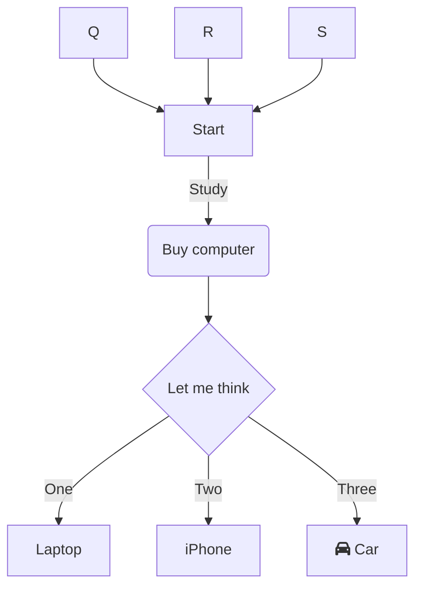

# ethereum relations

Use [GitHub + Mermaid](https://chrome.google.com/webstore/detail/github-%20-mermaid/goiiopgdnkogdbjmncgedmgpoajilohe) extension

```mermaid
graph TD
Q-->A
R-->A
S-->A
A[Start] -->|Study| B(Buy computer)
B --> C{Let me think}
C -->|One| D[Laptop]
C -->|Two| E[iPhone]
C -->|Three| F[fa:fa-car Car]
click A "http://www.github.com" "This is a link"
```
